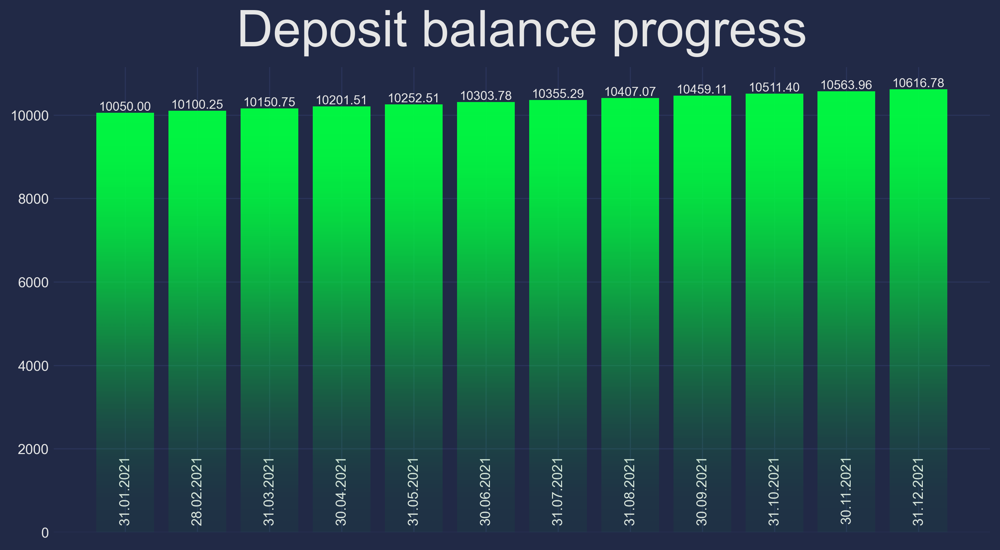

## <a id='toc1_1_'></a>[__Compound Interest Calculator__](#toc0_)

**Содержание**<a id='toc0_'></a>
- [__Compound Interest Calculator__](#toc1_1_)
    - [__Главное__](#toc1_1_1_)
    - [__Amount handler__](#toc1_1_2_)
    - [__Chart__](#toc1_1_3_)
    - [__О поле `date`__](#toc1_1_4_)
    - [__О приведении типов__](#toc1_1_5_)
    - [__Отчет `pytest` + `pytest-cov` и перечень юнит-тестов__](#toc1_1_6_)

<!-- vscode-jupyter-toc-config
	numbering=false
	anchor=true
	flat=false
	minLevel=1
	maxLevel=6
	/vscode-jupyter-toc-config -->
<!-- THIS CELL WILL BE REPLACED ON TOC UPDATE. DO NOT WRITE YOUR TEXT IN THIS CELL -->

***
### <a id='toc1_1_1_'></a>[__Главное__](#toc0_)

Добрый день, коллеги, и спасибо за ваше уделенное время!

Я подошел к тестовому заданию творчески и несколько разнообразил его:
1. Добавил возможность разработчику реализовывать кастомные логики обработки центов и масштабирования баланса депозита. Подробнее в разделе [__Amount handler__](#toc1_1_2_).

2. Ответ приложения в успешном сценарии, помимо графика капитализации процентов, также содержит ссылку на соответствующую столбчатую диаграмму в png. Подробнее в разделе [__Chart__](#toc1_1_3_).

3. Изменил структуру ответа в случае ошибки валидации: руководствуясь заботой о пользователе, приложение проверяет входные данные полностью и предоставляет отчет обо всех ошибках, с указанием полей, а не прерывает валидацию после первой обнаруженной.

4. Докеризированное приложение уже развернуто на [__compound-interest-calculator.containerapps.ru__](https://compound-interest-calculator.containerapps.ru) — в сервисе Container Apps на cloud.ru. Образ залит в мой реестр на сервисе Artifact Registry cloud.ru.

5. Кастомизировал OpenAPI схему приложения для соответствия условиям задания: примеры запросов и ответов, их JSON-схемы. Код при ошибке валидации изменен с `422` по умолчанию на `400`.

***
### <a id='toc1_1_2_'></a>[__Amount handler__](#toc0_)

Алгоритм расчета депозита, приведенный в задании, базируется на степенной формуле. При этом в ответ попадают числа, округленные до второго знака. И хотя степенной подход быстрый, у него есть проблемы.

Во-первых, насколько я знаю, в реальной банковской практике центы округляются не по правилам математики, а до целого цента вниз (_floor_). Соответственно, если имеет место сценарий с периодической капитализацией процентов (фактической — т.е. с реальным зачислением процентов на депозит), то это зачисление производится с применением floor-стратегии обработки центов. В этом случае степенная формула уже неприменима, потому что сумма на дату зависит не от стартовой суммы депозита и числа прошедших месяцев, а от суммы на предыдущую дату, детерминированной с точностью до целого цента, что фактически означает рекуррентный подход.

Во-вторых, степенной подход не гибок и не позволяет трансформировать текущую сумму в случае, если мы хотим, скажем, ввести дополнительные премиальные условия или, наоборот, ввести логику учета налогов или частичных снятий. Рекуррентный подход, напротив, позволяет все это сделать.

Ближе к коду. В приложении реализован базовый абстрактный класс `AmountНandler`, потомки которого обязаны переопределить абстрактный метод `handle_cents`. В этом методе, следуя его имени, разработчик должен определить логику обработки центов. Также `AmountНandler` позволяет применять к текущей сумме повышающий (премиальный) или понижающий (скажем, налоговый) коэффициент, `scale`, если дата капитализации процентов попадает во временной интервал активности обработчика.

Логика из примера к заданию реализована в классе-потомке `BypassAmountHandler`, а соответствующий сценарий работы приложения крутится на эндпоинте `/standard`.

Floor-стратегия обработки центов реализована в классе `FloorAmountHandler`. Сценарий работы приложения с использованием экземпляра этого обработчика, который в качестве примера также применяет общее пятипроцентное премирование в летние месяцы 2021 года, крутится на эндпоинте `/special`.

***
### <a id='toc1_1_3_'></a>[__Chart__](#toc0_)

Ответ приложения в успешном сценарии содержит два ключа. Значение по ключу `data` — график капитализации процентов, по ключу `chart` — прямая ссылка на соответствующую графику столбчатую диаграмму в png. При запросе, без промежуточного сохранения на диск, изображение отправляется в бакет S3 и генерируется прямая ссылка со сроком жизни 180 секунд по умолчанию.

Пример диаграммы из ответа `/standard`:



При разработке креды бакета попадали в переменные окружения с помощью `.env` и `python-dotenv`. В докер-образе кредов, разумеется, нет, а в контейнер, в развернутое в ContainerApps приложение, креды прокидываются сервисом Secret Manager того же cloud.ru.

***
### <a id='toc1_1_4_'></a>[__О поле `date`__](#toc0_)

В тексте задания, вероятно, допущена неточность (возможно, намеренно). Описание поля `date` — _дата заявки_, из чего можно предположить, что это предполагаемая дата открытия депозита. Но в примере ответа в успешном сценарии мы видим ту же дату у первой записи, что и в запросе. Из этого я делаю вывод, что это не дата открытия депозита, а дата первой капитализации процентов. Другими словами, моделируется сценарий, когда пользователь указывает в запросе дату, когда он уже хочет получить свой первый месячный доход.

***
### <a id='toc1_1_5_'></a>[__О приведении типов__](#toc0_)

Если данные поля запроса не соответствуют строго типу по спецификации данного поля, но приводимы к нему (_coercible_), например, `"12"` -> `12`, то валидатор не возбуждает исключения. Я исхожу из того, что наша цель — дать пользователю максимально "понятливый" дружелюбный сервис, и поэтому нет смысла придираться по мелочам, если их можно поправить на лету.

***
### <a id='toc1_1_6_'></a>[__Отчет `pytest` + `pytest-cov` и перечень юнит-тестов__](#toc0_)

```
$ pytest --cov-report term-missing --cov-report html:htmlcov --cov=.
================================== test session starts ==================================
platform win32 -- Python 3.12.7, pytest-8.3.5, pluggy-1.5.0
rootdir: D:\git\compound-interest-calculator
configfile: pytest.ini
plugins: anyio-4.8.0, cov-6.0.0
collected 24 items

test_main.py ........................                                              [100%]

---------- coverage: platform win32, python 3.12.7-final-0 -----------
Name           Stmts   Miss  Cover   Missing
--------------------------------------------
__init__.py        0      0   100%
handlers.py       32      1    97%   63
main.py           68      0   100%
settings.py       12      0   100%
test_main.py     151      0   100%
tools.py          50      1    98%   53
--------------------------------------------
TOTAL            313      2    99%
Coverage HTML written to dir htmlcov


================================== 24 passed in 14.00s ==================================
```

Перечень юнит-тестов из `test_main.py`:

<div>
<table border="1" class="dataframe">
  <thead>
    <tr style="text-align: right;">
      <th></th>
      <th>endpoint</th>
      <th>test name</th>
      <th>description</th>
    </tr>
  </thead>
  <tbody>
    <tr>
      <th>1</th>
      <td>/standard</td>
      <td>test_task_example</td>
      <td>test example given in the task</td>
    </tr>
    <tr>
      <th>2</th>
      <td>/standard</td>
      <td>test_invalid_day</td>
      <td>date: invalid day</td>
    </tr>
    <tr>
      <th>3</th>
      <td>/standard</td>
      <td>test_non_existing_day</td>
      <td>date: non-existing day</td>
    </tr>
    <tr>
      <th>4</th>
      <td>/standard</td>
      <td>test_invalid_month</td>
      <td>date: invalid month</td>
    </tr>
    <tr>
      <th>5</th>
      <td>/standard</td>
      <td>test_year_eq_min</td>
      <td>date: minimum valid value of the year</td>
    </tr>
    <tr>
      <th>6</th>
      <td>/standard</td>
      <td>test_year_lt_min</td>
      <td>date: less than minimum valid value of the year</td>
    </tr>
    <tr>
      <th>7</th>
      <td>/standard</td>
      <td>test_year_eq_max</td>
      <td>date: maximum valid value of the year</td>
    </tr>
    <tr>
      <th>8</th>
      <td>/standard</td>
      <td>test_year_gt_max</td>
      <td>date: year exceeds maximum valid value</td>
    </tr>
    <tr>
      <th>9</th>
      <td>/standard</td>
      <td>test_invalid_date_format</td>
      <td>date: invalid format</td>
    </tr>
    <tr>
      <th>10</th>
      <td>/standard</td>
      <td>test_leap_year</td>
      <td>date: leap year</td>
    </tr>
    <tr>
      <th>11</th>
      <td>/standard</td>
      <td>test_day_month_no_zeros</td>
      <td>date: day and month with no leading zeros</td>
    </tr>
    <tr>
      <th>12</th>
      <td>/standard</td>
      <td>test_int_coercible_float</td>
      <td>periods, amount: float coercible to integer</td>
    </tr>
    <tr>
      <th>13</th>
      <td>/standard</td>
      <td>test_non_coercible_float</td>
      <td>periods, amount: float not coercible to integer</td>
    </tr>
    <tr>
      <th>14</th>
      <td>/standard</td>
      <td>test_int_coercible_string</td>
      <td>periods, amount: string coercible to integer</td>
    </tr>
    <tr>
      <th>15</th>
      <td>/standard</td>
      <td>test_treat_true_as_1</td>
      <td>periods, rate: treat True as 1</td>
    </tr>
    <tr>
      <th>16</th>
      <td>/standard</td>
      <td>test_treat_false_as_0</td>
      <td>periods, rate: treat False as 0</td>
    </tr>
    <tr>
      <th>17</th>
      <td>/standard</td>
      <td>test_all_invalid</td>
      <td>date, periods, amount, rate: None/null</td>
    </tr>
    <tr>
      <th>18</th>
      <td>/standard</td>
      <td>test_periods_amount_rate_eq_min</td>
      <td>periods, amount, rate: minimum valid values</td>
    </tr>
    <tr>
      <th>19</th>
      <td>/standard</td>
      <td>test_periods_amount_rate_lt_min</td>
      <td>periods, amount, rate: less than minimum valid values</td>
    </tr>
    <tr>
      <th>20</th>
      <td>/standard</td>
      <td>test_periods_amount_rate_eq_max</td>
      <td>periods, amount, rate: maximum valid values</td>
    </tr>
    <tr>
      <th>21</th>
      <td>/standard</td>
      <td>test_periods_amount_rate_gt_max</td>
      <td>periods, amount, rate: exceed maximum valid values</td>
    </tr>
    <tr>
      <th>22</th>
      <td>/special</td>
      <td>test_special_endpoint</td>
      <td>1-year correctness test</td>
    </tr>
    <tr>
      <th>23</th>
      <td>/</td>
      <td>test_redirect_to_docs</td>
      <td>test redirect from root to FastAPI Swagger docs</td>
    </tr>
    <tr>
      <th>24</th>
      <td>no endpoint</td>
      <td>test_custom_openapi</td>
      <td>test custom_openapi function works as expected</td>
    </tr>
  </tbody>
</table>
</div>